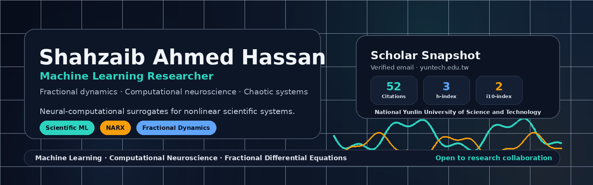
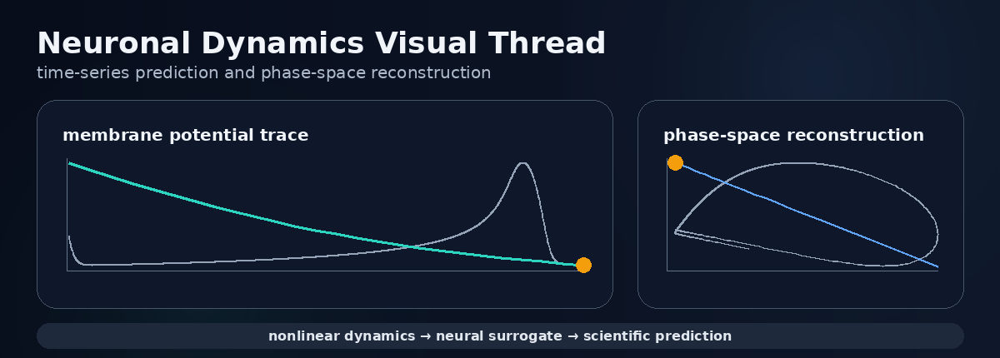
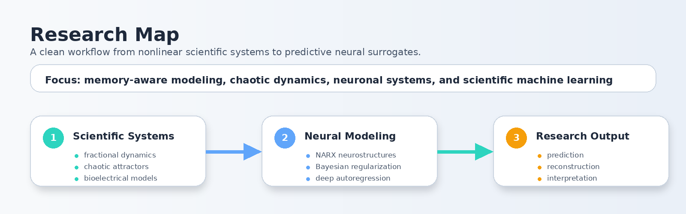

  

  
  

  
  
  
  

<h1 align="center">Shahzaib Ahmed Hassan</h1>

  <b>Machine Learning Researcher</b> · Fractional Differential Equations · Computational Neuroscience · Chaotic Dynamical Systems

---

## Research Identity

I work on **machine-learning-driven computational modeling** for nonlinear, chaotic, fractional-order, and neuro-dynamical systems. My research focuses on building intelligent neural surrogates that can approximate, reconstruct, and analyze complex scientific dynamics where **memory, instability, and nonlinearity** are central to the system.

<table>
  <tr>
    <td width="33%" valign="top">
      <h3>Systems</h3>
      <ul>
        <li>Fractional-order dynamics</li>
        <li>Chaotic attractors</li>
        <li>Neuronal firing models</li>
        <li>Bioelectrical systems</li>
      </ul>
    </td>
    <td width="33%" valign="top">
      <h3>Methods</h3>
      <ul>
        <li>NARX neurostructures</li>
        <li>Bayesian regularization</li>
        <li>Deep autoregression</li>
        <li>Scientific ML surrogates</li>
      </ul>
    </td>
    <td width="33%" valign="top">
      <h3>Outputs</h3>
      <ul>
        <li>Prediction</li>
        <li>Reconstruction</li>
        <li>Excitability analysis</li>
        <li>Reproducible simulation</li>
      </ul>
    </td>
  </tr>
</table>

---

## Neuronal Dynamics Visual Thread

  

---

## Selected Publications

Full publication record: **[Google Scholar](https://scholar.google.com/citations?user=1xD1zTQAAAAJ&hl=en)**

| Year | Publication | Venue |
|---:|---|---|
| 2025 | **A hybrid neural-computational paradigm for complex firing patterns and excitability transitions in fractional Hindmarsh–Rose neuronal models** | *Chaos, Solitons & Fractals* |
| 2025 | **Design of intelligent Bayesian regularized deep cascaded NARX neurostructure for predictive analysis of FitzHugh–Nagumo bioelectrical model in neuronal cell membrane** | *Biomedical Signal Processing and Control* |
| 2024 | **Nonlinear chaotic Lorenz–Lü–Chen fractional order dynamics: A novel machine learning expedition with deep autoregressive exogenous neural networks** | *Chaos, Solitons & Fractals* |
| 2025 | **Design of stochastic backpropagative autoregressive exogenous neuroarchitectures for predictive analysis of fractional-order nonlinear Rabinovich–Fabrikant chaotic attractors** | *Nonlinear Dynamics* |
| 2025 | **Novel design of fractional cholesterol dynamics and drug concentrations model with analysis on machine predictive networks** | *Computers in Biology and Medicine* |
| 2026 | **A hybrid intelligent computational framework for diverse firing patterns in a fractional-order locally active memristive neuron model** | *Chaos, Solitons & Fractals* |
| 2026 | **Deep multi-layered autoregressive neuro-structures for predictive modelling of nonlinear chaotic Lorenz–Lü–Chen systems in Rayleigh–Bénard convection** | *International Journal of Computer Mathematics* |

---

## Research Map

  

---

## Technical Stack

  
  
  
  
   
  
  
  
  

---

## Collaboration

I am open to research collaborations involving **fractional-order systems**, **chaotic dynamics**, **computational neuroscience**, and **scientific machine learning**.

  National Yunlin University of Science and Technology · Verified email: yuntech.edu.tw

