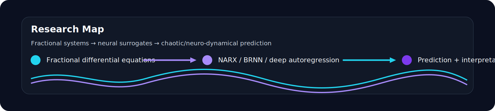

<picture>
  <source media="(prefers-color-scheme: dark)" srcset="assets/profile/hero-dark.svg">
  
</picture>

<p align="center"><i>Building intelligent surrogates for fractional, chaotic, and neuro-dynamical systems.</i></p>

<h1 align="center">Shahzaib Ahmed Hassan</h1>

<p align="center">
  <a href="https://scholar.google.com/citations?user=1xD1zTQAAAAJ&hl=en">
    
  </a>
  
  
  
  <a href="mailto:m11217081@yuntech.edu.tw">
    
  </a>
</p>

```toml
[profile]
name        = "Shahzaib Ahmed Hassan"
role        = "Machine Learning Researcher"
affiliation = "National Yunlin University of Science and Technology"
verified    = "yuntech.edu.tw"
location    = "Taiwan"

[research]
focus       = "Fractional neurocomputing, chaotic systems, and machine-learning surrogates"
keywords    = [
  "machine learning",
  "computational neuroscience",
  "fractional differential equations",
  "chaotic dynamical systems",
  "NARX neural networks",
  "Bayesian regularized neural networks",
  "scientific machine learning"
]

[status]
open-to     = ["research collaborations", "academic writing", "scientific machine learning projects"]
last-update = "2026-05"
```

---

## Research Focus

I work on **machine-learning-driven computational modeling** for nonlinear, chaotic, fractional-order, and neuro-dynamical systems. My research connects **fractional differential equations**, **computational neuroscience**, **chaotic attractors**, and **deep/autoregressive neural architectures** to build predictive models for complex scientific systems.

The central theme of my work is the design of intelligent computational frameworks that can approximate, reconstruct, and analyze complex dynamics where memory, nonlinearity, and instability are part of the system rather than noise.

```python
from dataclasses import dataclass

@dataclass(frozen=True)
class ResearchProfile:
    name: str = "Shahzaib Ahmed Hassan"
    affiliation: str = "National Yunlin University of Science and Technology"
    fields: tuple[str, ...] = (
        "machine learning",
        "computational neuroscience",
        "fractional differential equations",
        "chaotic dynamical systems",
        "scientific machine learning",
    )
    methods: tuple[str, ...] = (
        "deep autoregressive exogenous neural networks",
        "Bayesian-regularized neural networks",
        "NARX neurostructures",
        "machine predictive networks",
        "neural-computational surrogates",
    )
```

---

## Open Questions

> [!IMPORTANT]
> **Q1 · Fractional neural surrogates for complex dynamics.**  
> How can neural networks approximate fractional-order systems while preserving long-memory behavior, nonlinear transitions, and physically meaningful dynamics?

> [!IMPORTANT]
> **Q2 · Machine learning for chaotic and neuronal systems.**  
> How can data-driven neurocomputational models improve prediction and interpretation of chaotic attractors, neuronal excitability transitions, and nonlinear bioelectrical systems?

---

## Selected Publications

Full publication record: [Google Scholar](https://scholar.google.com/citations?user=1xD1zTQAAAAJ&hl=en)

1. **A hybrid neural-computational paradigm for complex firing patterns and excitability transitions in fractional Hindmarsh–Rose neuronal models.**  
   *Chaos, Solitons & Fractals*, 2025.

2. **Design of intelligent Bayesian regularized deep cascaded NARX neurostructure for predictive analysis of FitzHugh–Nagumo bioelectrical model in neuronal cell membrane.**  
   *Biomedical Signal Processing and Control*, 2025.

3. **Nonlinear chaotic Lorenz–Lü–Chen fractional order dynamics: A novel machine learning expedition with deep autoregressive exogenous neural networks.**  
   *Chaos, Solitons & Fractals*, 2024.

4. **Design of stochastic backpropagative autoregressive exogenous neuroarchitectures for predictive analysis of fractional-order nonlinear Rabinovich–Fabrikant chaotic attractors.**  
   *Nonlinear Dynamics*, 2025.

5. **Novel design of fractional cholesterol dynamics and drug concentrations model with analysis on machine predictive networks.**  
   *Computers in Biology and Medicine*, 2025.

6. **A hybrid intelligent computational framework for diverse firing patterns in a fractional-order locally active memristive neuron model.**  
   *Chaos, Solitons & Fractals*, 2026.

7. **Deep multi-layered autoregressive neuro-structures for predictive modelling of nonlinear chaotic Lorenz–Lü–Chen systems in Rayleigh–Bénard convection.**  
   *International Journal of Computer Mathematics*, 2026.

```bibtex
@article{hassan2025fractional_neurocomputing,
  title   = {A hybrid neural-computational paradigm for complex firing patterns and excitability transitions in fractional Hindmarsh--Rose neuronal models},
  author  = {Hassan, Shahzaib Ahmed and Raja, Muhammad Junaid Ali Asif and others},
  journal = {Chaos, Solitons \& Fractals},
  year    = {2025}
}
```

---

## Research Areas

- Fractional-order dynamical systems  
- Computational neuroscience  
- Chaotic attractors and nonlinear dynamics  
- Scientific machine learning  
- NARX and autoregressive neural networks  
- Bayesian-regularized neural modeling  
- Predictive modeling of biological and physical systems  

---

## Academic Profile

**Affiliation:** National Yunlin University of Science and Technology  
**Verified email:** yuntech.edu.tw  
**Google Scholar:** [Shahzaib Ahmed Hassan](https://scholar.google.com/citations?user=1xD1zTQAAAAJ&hl=en)

---

## Technical Stack

<p>
  
  
  
  
  <br>
  
  
  
  <br>
  
  
  
</p>

---

<p align="center">
  
</p>

<p align="center">
  <sub>Open to academic collaborations in fractional neurocomputing, chaotic systems, and scientific machine learning.</sub>
</p>
